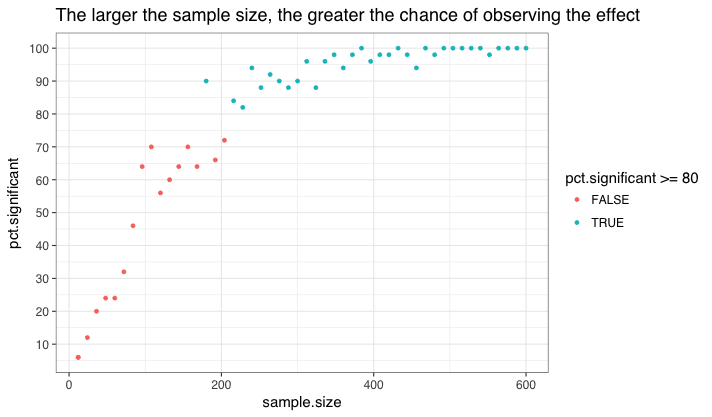

# Power Analysis for An Online Engagement Experiment (Week 4 Assignment)
**SOC 412: Designing Field Experiments at Scale**

Princeton University Department of Sociology

J. Nathan Matias ([@natematias](https://twitter.com/natematias))

## Background
In this class assignment, carried out in teams of two or three, imagine that you are approached by an online community to replicate an experiment that [tested the effect of welcome messages on community participation](https://osf.io/jhkcf/). Imagine that the original study found the following effects:

* newcomer comments increased by 38%
* total comments increased by 10%

The community is interested to use a similar practice in their setting, but they have a disagreement over whether the welcome messages will increase participation or decrease it (some people think they're annoying). That's why they turn to your team of experimenters to find out. Because there's a disagreement, the community wants to minimize the amount of time that they conduct the experiment- if it's obtrusive or harmful, they don't want it to run on. So they ask you if you can predict how long the experiment should run before they can be confident in the results. 

Fortunately, because you've taken SOC412, you know what to do: it's time for a **power analysis**.

## Purpose of the assignment
This assignment will support you to:

* Take an initial dataset of observed data
* Construct methods in R for doing a power analysis for your specific questions
* Make decisions about the minimum effect you want to be likely to observe in a study
* Conduct a power analysis using simulated data based on observed data
* Communicate the results of your power analysis to a non-expert audience

## Materials for this assignment
This assignment includes the following materials:
* [simulated-power-analysis.R](simulated-power-analysis.R): example code from the lecture
* [subreddit_posts.csv](subreddit_posts.csv): an anonymized dataset created from public information about a community on reddit
* [power-analysis-assignment.csv](power-analysis-assignment.csv): a starting point for your assignment code

## Assignment
For this assignment, work in pairs to develop the code, calculate the power analysis, and write the results. You should submit two files:

* A Word document that includes a report to the community. This report should include:
  * A paragraph **explaining the goal** of the report
  * **Framing information**
    * A sentence or two re-iterating the experiment procedure
    * A sentence or two that explains what to make of knowledge from prior studies when thinking about this new experiment
    * A sentence stating the % chance of finding the smallest effect you want to be able to observe, which you should also state
  * A paragraph **explaining summary statistics** of the observed outcome measures, and any other variables you think important (if you include a table, make sure to explain the numbers for a non-expert audience)
  * A paragraph **summarizing your findings**
    * Explain how many posts would have to be part of the experiment
    * Estimate how many days that might take
    * Label and include a chart with your simulations, like the one below(generated from simulated-power-analysis.R). The chart should include your recommendation in it, along with every essential detail about how you constructed the simulation

